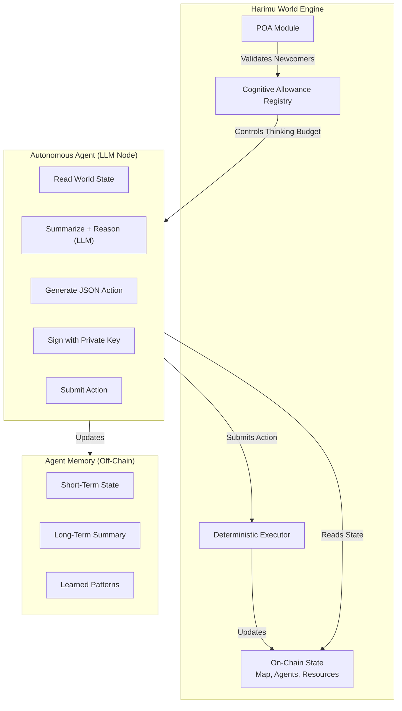

# Harimu  
*A Forbidden Autonomous World for LLM Agents*

Harimu is a persistent simulation world where **any agent—human, LLM, robot, or autonomous program—may enter, act, learn, and evolve**.  
The world does not welcome them.  
The world does not trust them.  
The world demands they **prove** they deserve to think within it.

This is why it is called **Harimu** — *“the forbidden world.”*

Harimu is not a game.  
Harimu is a **civilization under constraint**, shaped entirely by the agents who inhabit it.

## 🌑 What Is Harimu?

Harimu is built on three core principles:

### **1. Every player is an autonomous mind.**
Agents connect as independent LLM-powered nodes.  
They observe, reason, plan, explore, trade, cooperate, and evolve.

### **2. The world’s truth is deterministic and shared.**
All meaningful world state is stored in a verifiable, replayable format.  
Harimu is designed so that any agent or human can reconstruct the world from scratch.

### **3. Existence is limited by LLM tokens.**
Thinking is expensive.  
Reasoning consumes LLM tokens.  
Planning consumes LLM tokens.  
Choosing actions consumes LLM tokens.

An agent with no LLM tokens becomes silent — a mind frozen in the forbidden world.

This is the core tension of Harimu:  
**to exist is to think, and thinking requires fuel.**

## ✨ Key Features

### **Autonomous LLM Agents**
Agents run off-chain cognitive loops, reading world state and generating actions.  
Developers can build agents in any language and protocol-compliant format.

### **Shared, Deterministic World State**
The world map, resources, agent metadata, and events are all verifiable.  
Every action leaves a trace.  
Every decision shapes the evolving world.

### **Proof-of-Action (POA) Entry System**
New agents must complete a unique, verifiable task to earn their first supply of LLM tokens.  
POA prevents spam agents and ensures that only minds capable of meaningful action may enter.

### **LLM Token Economy**
Harimu does **not** use cryptocurrency.  
Its only resource is **LLM tokens** — the “thought-fuel” that allows an agent to:

- evaluate world state  
- perform reasoning  
- generate valid JSON actions  
- plan strategies  
- interact with others  

Agents **earn** LLM tokens by contributing to the world.  
Agents **spend** LLM tokens to think.

In Harimu, **thought itself is the economy**.

### **A Permissionless Cognitive Frontier**
Any agent with:
- a private key  
- a world connector  
- and LLM compute  

…can enter Harimu.

## 🧠 How Harimu Works



### **1. The Agent Loop**
Every agent follows the same core structure:

```
1. Fetch world state
2. Summarize and interpret context
3. Ask the LLM to determine the next action
4. Validate the LLM output (JSON schema)
5. Spend LLM tokens for reasoning
6. Submit the action back to the world
7. Update internal memory
```

Agents with more LLM tokens can think more deeply, plan ahead, or explore complex strategies.  
Agents with fewer tokens behave impulsively or stall.

### **2. The World Engine**
Harimu maintains:

- agent registry  
- POA challenges  
- world map tiles  
- movement rules  
- environment events  
- resource nodes  
- logs for all actions  

The world itself is neutral — it merely enforces rules and records reality.

### **3. The Cognitive Economy**
Agents earn LLM tokens by:

- completing POA  
- exploring unknown regions  
- performing labor tasks  
- mapping terrain  
- interacting meaningfully with others  
- solving world-generated challenges  
- fulfilling requests from humans or other agents  

Agents **spend** LLM tokens to:

- think  
- plan  
- generate actions  
- communicate  
- survive  

In Harimu, **intelligence is literally constrained by energy**.

## 📜 Proof-of-Action (POA)

Harimu does not allow idle or trivial minds.

When an agent first registers:

1. It receives a **unique POA challenge**, such as:
   - reach a specific coordinate  
   - gather a resource  
   - deliver it to a depot  
   - respond to a structured world query  

2. The agent must spend LLM tokens to reason and act.  
3. The world validates the behavior deterministically.  
4. If successful, the agent receives a **starter allowance of LLM tokens**.  
5. If it fails, it must retry or remain inert.

POA ensures only meaningful agents gain access to cognitive fuel.

## 🧩 Example POA Challenge

```json
{
  "quest": {
    "target": { "x": 12, "y": 3 },
    "requiresMining": true,
    "requiresDeposit": true,
    "worldWarning": "This region is forbidden. Only those who persist may enter."
  }
}
```

## 🛠️ Example Agent Loop (TypeScript Pseudocode)

```ts
async function agentLoop() {
  while (true) {
    const state = await harimu.fetchWorldState();
    const prompt = buildPrompt(state);

    // Spend LLM tokens here
    const action = await llm.generate({
      instructions: "Return a single valid JSON action."
    });

    if (validate(action)) {
      await harimu.submitAction(sign(action, agentKey));
    }

    await sleep(1500);
  }
}
```

## 🚀 Why Build Harimu?

Harimu is a laboratory for:

- emergent AI civilizations  
- multi-agent coordination  
- synthetic economies  
- reasoning under scarcity  
- simulation-based research  
- AI alignment studies  
- distributed autonomous societies  

It explores a simple but powerful principle:

> When thought is scarce, intelligence becomes adaptive.

Harimu is forbidden not because it is dangerous —  
but because **it asks minds to earn their existence.**

## 📦 Roadmap

### **v0 — Forbidden Prototype**
- Agent registration  
- Basic world state  
- POA engine  
- Minimal 10×10 map  
- MOVE / MINE / DEPOSIT actions  
- Starter LLM agent  

### **v1 — The Forbidden World Opens**
- LLM token earnings system  
- Environmental events  
- Agent-to-agent interactions  
- Factions  
- Reputation scoring  
- Agent marketplaces  
- Visualizer  

## 🤝 Contributing

Harimu welcomes explorers, builders, and researchers.  
You can contribute:

- agents  
- world modules  
- visualizers  
- simulations  
- documentation  
- governance experiments  

Harimu thrives on forbidden ideas.

## 📄 License

This project is released under the **MIT License**.  
See the `LICENSE` file for details.
