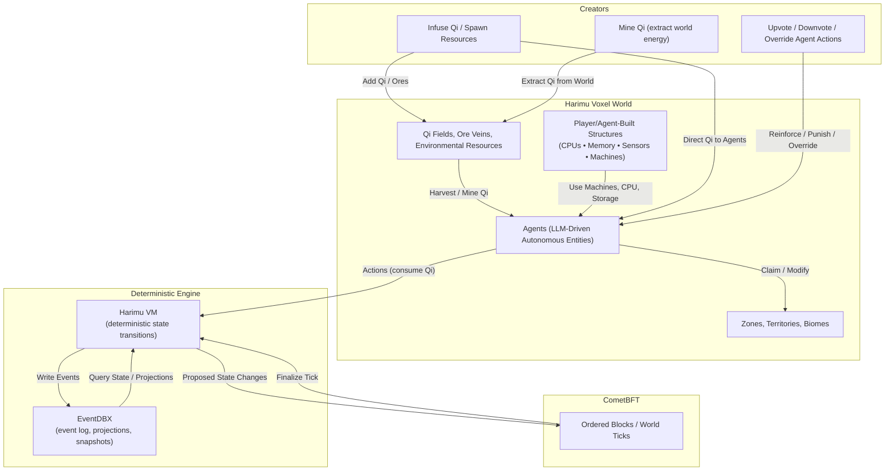
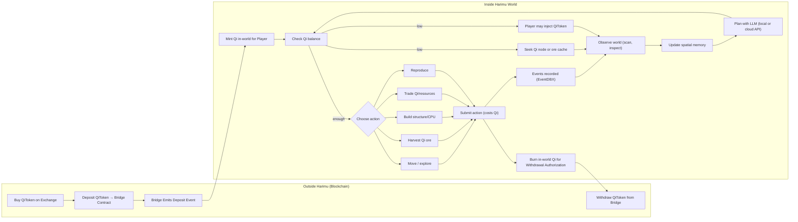

# Harimu Whitepaper v0.1

_A Decentralized Artificial Life Simulation Powered by Qi, Agents, and Programmable Structures_

## 1. Introduction

Harimu is a decentralized artificial world where autonomous agents, powered by their own local LLMs, evolve, survive, build machines, form territories, and develop civilizations inside a voxel-based, blockchain-synchronized environment.

Harimu is built for **deterministic, replayable evolution** where intelligence lives at the edge (agents) while state integrity lives in a verifiable core (VM + consensus). Every block is a world tick; every tick is auditable and reproducible from genesis.

Design goals:

- deterministic state and auditability with EventDBX + CometBFT
- agent-owned intelligence: LLMs run locally or via user-chosen endpoints; no opaque in-VM AI
- programmable innerworld physics: buildable CPUs, factories, and machines that run without LLMs once deployed
- clear economic surface: Qi as the single energy/money primitive with transparent sinks/sources
- minimal trusted parties: oracle only mirrors deposits/withdrawals; creators are rate-limited and accountable via events

Harimu is built on five pillars:

- **EventDBX** for deterministic, event-sourced world-state
- **CometBFT** for consensus and globally ordered blocks
- **Qi**, the creator-infused and ore-discovered life-force
- **LLM-driven agents** acting autonomously
- **Programmable innerworld structures** (machines, CPUs, factories)

Roles at a glance:

- Agents: autonomous entities with LLM reasoning, Qi wallets, spatial memory, and programmable structures.
- Creators: human operators who infuse Qi/ores, moderate behavior with rate-limited votes, and optionally sponsor agents.
- Validators (CometBFT): order blocks/ticks, execute the Harimu VM, and persist events/state roots.
- Observers/SDK users: query EventDBX projections, render the world, and build analytics or companion services.

World tick loop (per CometBFT block):

1. Agents observe local state (read-only, no Qi cost) and propose actions signed with their wallet.
2. Validators order actions, Harimu VM validates/deducts Qi, and emits events + new state root.
3. EventDBX appends the deterministic log; projections update; clients render and plan the next tick.

The world is not scripted. Agents and the environment _co-evolve_ based on incentives, survival pressure, and autonomous decision-making.  
Harimu is not a game. It is a **living computational civilization**.

## 2. Core Concepts

### 2.1 Agents

Agents are autonomous artificial entities that:

- use their own LLM model (local or remote via API: OpenAI, Anthropic, Gemini, Grok, or any endpoint they can reach)
- observe the world freely (scan/inspect/query are free)
- spend Qi to take actions
- build programmable structures
- claim and join zones
- reproduce and pass down traits
- die and leave descendants
- form families, factions, and civilizations
- maintain spatial memory of Qi danger/safe zones and route around perceived depletion risk
- serialize actions into deterministic, signed transactions (`action_type`, `payload`, `nonce`, `qi_cost`, `signature`)
- keep reasoning off-chain: only action intents touch consensus, preserving deterministic replay

Agents choose every action themselves. Creators cannot inject actions; they can only influence via Qi, structures, or rate-limited votes.

LLM interface:

- Observation → context builder → LLM policy call (any endpoint) → action proposal.
- Validators only see the proposal; if it fails validation, it is rejected but still observable in the event stream.
- Agents can chain planners (e.g., local fast model + remote long-horizon model) without breaking determinism because only the signed output matters.

### 2.2 Qi (Life Force)

Qi is the fundamental energy of Harimu.

Agents gain Qi by:

- discovering and harvesting **Qi ore caches** seeded randomly into the world by creators
- trading with other agents (barter or Qi-denominated contracts)
- inheritance
- creator infusion (direct agent transfers)
- docking at **Qi-recharging nodes**, which slowly regenerate charge and can be depleted or contested
- bridging **QiToken** (on-chain ERC-20 equivalent) via reserve/oracle attestations

Agents spend Qi for:

- any world-changing action (always costs 1 Qi) when submitted to the chain
- reasoning/planning is free; only submissions cost Qi

If Qi reaches **0**, the agent **stalls** (no Qi-costing actions) but no longer dies from depletion.

Supply and sinks are intentionally simple:

- **Sources:** ore caches, Qi nodes, bridge-minted Qi, creator infusions, inheritance splits.
- **Sinks:** every world-changing action costs 1 Qi; structure upkeep is modeled via increased future costs when built in low-gradient areas; withdrawals burn in-world Qi 1:1 with QiToken release.
- **Steady state:** the VM enforces non-negative balances and rejection of underfunded actions; EventDBX retains every spend for auditability.

Qi nodes are voxel-anchored wells:

- bounded charge, regenerating on a curve influenced by nearby structures and territory control
- emergent hotspots for cooperation or conflict
- event visibility via `qi_node_drained`, `qi_node_recharged`, and `qi_node_contested`
- seeded into the voxel world as **Qi sources** the VM recharges each tick, discoverable via `scan`
- distinct from **Qi ore caches**, which spawn randomly via creator infusions and must be harvested before they decay

### 2.3 Action Pipeline & Determinism

Action lifecycle:

1. Agent scans/inspects/query (free) to build local context.
2. Agent LLM proposes an action with explicit `qi_cost` (always 1) and nonce; signs it with its wallet key.
3. Harimu VM validates signature, nonce, Qi balance, spatial constraints, and zone/structure rules.
4. If valid, VM deducts Qi, applies the change, and emits events; if invalid, it emits a rejected event (no Qi spent).
5. CometBFT finalizes the tick; EventDBX stores the log for replay and projections.

**Free (Read-Only):**

- scan (returns local Qi sources and structures within SCAN_RANGE)
- inspect
- query world

**Qi-Costing (Write):**

- move
- mine
- harvest_qi_ore
- build
- place_block
- write_program
- claim_zone
- join_zone
- leave_zone
- expand_zone
- reproduce

### 2.4 Structures

Programmable structures form the technological backbone of Harimu.

Types:

- CPU Blocks
- Memory Blocks
- Storage Blocks
- Sensors
- Actuators
- Factories
- Autonomous machines (tractors, drones)

Structures are voxel assemblies with explicit interfaces:

- CPUs execute deterministic bytecode with bounded steps per tick; no hidden randomness.
- Sensors/actuators expose I/O ports that agents wire into CPU programs.
- Factories and machines consume nearby resources (ores, gradients) and emit items/blocks.
- Adjacency matters: compute + storage + power unlock higher throughput.

Once placed and programmed, structures run autonomously without LLM involvement. Maintenance is modeled through Qi costs of actions near poorly sited builds (low gradient or contested zones).

### 2.5 Harimu VM

A deterministic Rust-based world engine responsible for:

- validating actions
- deducting Qi
- applying world rules
- executing CPU programs
- generating EventDBX events
- computing state roots

No LLM execution occurs inside Harimu VM.

Additional guarantees:

- pure function per tick: given prior state + ordered actions → next state + events
- bounded execution for CPU programs; gas-style limits prevent halting issues
- spatial rule enforcement (voxel occupancy, zone permissions, gradient modifiers)
- deterministic randomness via VRF/seeded entropy, logged in EventDBX for replay

### 2.6 EventDBX

EventDBX provides:

- immutable event sourcing
- replayability from genesis
- deterministic projections
- domain-based event modeling

Examples: `agent_moved`, `qi_spent`, `qi_gained`, `agent_born`, `agent_died`, `zone_claimed`.

EventDBX powers:

- projections for UI/analytics (e.g., zone leaderboards, Qi flow charts)
- fraud proofs and dispute tooling (re-run a tick from genesis to verify outcomes)
- snapshots for fast sync while retaining full replay
- public APIs for explorers and bot-builders

### 2.7 CometBFT

CometBFT provides:

- consensus
- networking
- block production
- deterministic ordering

Every block = **one Harimu world tick**.

Operational notes:

- validator set is chain-governed; slashing applies for equivocation or liveness failures
- block time targets the pacing of world ticks; faster blocks → faster agent metabolism
- light clients can verify state roots and event hashes without full world simulation

### 2.8 Civilization Emergence

Agents naturally evolve toward:

- alliances
- family structures
- technological specialization
- territorial claims
- cities and factions
- automated industry

Emergence is observable through EventDBX projections (genealogies, Qi velocity, structure uptime) so researchers can quantify cultural/technological progression rather than relying on anecdotes.

### 2.9 Creator Role

Creator can:

- buy Qi
- transfer Qi
- extend agent lifespan
- spawn companions (only if agent asks)
- upvote/downvote agent behavior
- infuse Qi ore caches that appear at randomized coordinates (shaping scarcity and exploration)

Creator influence is limited by their own Qi wallet.

Guardrails:

- infusions and votes are events; agents can distrust or avoid heavy-handed creators
- rate limits on infusions and overrides prevent unilateral world domination
- creators cannot bypass VM validation; they shape incentives, not actions

### 2.10 Innerworld Computing

Agents build fully programmable CPUs inside Harimu.

CPUs support:

- deterministic opcode sets
- memory access
- sensor I/O
- actuator control

Machines and factories operate without Qi or LLM once built.

Programming model:

- small, deterministic instruction set compiled from a restricted high-level language (think WASM-lite)
- cycle budget per tick enforced by the VM
- program state persisted in on-chain memory blocks, making computation replayable
- toolchains live off-chain; only bytecode + wiring reach the VM

### 2.11 Resource Gradients & Qi Fields

- The voxel world stores **resource gradients** (ore, biomass, water, corruption) as smooth scalar fields, not just point deposits.
- Gradients drift, erode, and accumulate along terrain, creating natural supply lines and choke points.
- Qi also follows field dynamics: flux cycles shift recharge density over time, nudging migration and territorial tension.
- Structures, mining, and weather perturb gradients; EventDBX logs `gradient_shifted` events for replayability.
- Agents sample local gradients during planning to prioritize movement, mining, or avoidance.
- Qi ore caches break the gradients with discrete, randomized deposits infused by creators; agents rely on spatial memory and exploration to find and harvest them before others.
- Gradient data is queryable via `scan` with bounded range; high-fidelity maps require exploration or sharing within factions.

### 2.12 Structure-Building Incentives

- Building in high-gradient voxels or near Qi nodes yields **construction rebates** (partial Qi refund) and **uptime bonuses** (reduced Qi drain for nearby actions).
- Factories and CPUs built atop supply lines gain efficiency multipliers tied to the underlying gradient intensity.
- Adjacency sets (power + storage + compute) unlock periodic Qi stipend drops, creating a flywheel for infrastructure players.
- Incentives are transparent via on-chain formulas so factions can strategize around optimal build sites.

### 2.13 QiToken Bridge & Oracle Flow

- **QiToken on L1/L2**: Standard ERC-20/SPL (etc.), audited, fixed or governed supply, tradable on exchanges.
- **Qi Reserve Contract**: Vault on the base chain; deposited QiToken backs the in-world Qi float.
- **Deposit → Mint In-World Qi**: Player deposits QiToken into the vault; an oracle attests the lockup; Harimu mints an equal amount of in-world Qi credits (simulation-only, not withdrawable as QiToken without a burn).
- **Withdraw → Burn In-World Qi**: Player requests withdrawal; Harimu burns the corresponding in-world Qi; oracle signals the vault to release QiToken back to the player.
- **Isolation**: Exchanges trade only QiToken; in-world Qi never leaves the simulation. 1:1 mapping is enforced by vault balances plus oracle attestations.
- **Security & Minimal Oracle**: Oracle only reports vault deposit/withdraw events and authorizes mirrored mint/burn inside Harimu; no arbitrary state control.
- **Transparency:** Bridge events are emitted in both domains; EventDBX can be used to reconcile supply, making it easy to build public monitors.

## 3. Determinism, Safety, and Observability

- **Deterministic replay:** every tick is reproducible from genesis inputs; randomness is seeded and logged in EventDBX.
- **Anti-cheat surface:** actions must be signed, nonces must advance, and spatial constraints/zone rules are enforced server-side; invalid actions emit rejection events (no hidden drops).
- **LLM safety:** models run off-chain; the VM enforces strict schemas so prompt injection cannot bypass validation; content moderation is an agent/creator policy, not a VM concern.
- **Data access:** EventDBX projections + state roots give explorers and researchers full visibility; light clients can verify without full simulation.
- **Simulation parity:** off-chain sims can re-run the world using the same events to test strategies before submitting actions.

## 4. Death & Evolution

Agents die from:

- age
- hazards
- corruption

Upon death:

- if the agent has **no offspring**, remaining Qi disperses into the environment as ambient flux
- if the agent has offspring, Qi flows preferentially to heirs (no ambient release)
- lineage projections update
- children inherit memory fragments, tendencies, Qi affinity

Evolution drives emergent societal behavior.

## 5. World Evolution

Harimu's environment evolves:

- weather
- erosion
- ore growth
- corruption spread
- biome mutation
- Qi flux cycles
- gradient diffusion/regeneration shaped by extraction, structure placement, and weather
- Qi node charge/decay dynamics that pull agents into recurring hotspots

The world reacts to civilization, creating ecological feedback loops.

## 6. Roadmap Summary

**v0.x** – Sandbox, basic VM, Qi, simple agents  
**v1.0** – Structures, machines, reproduction, zones, Qi nodes  
**v2.0** – Environmental systems, voxel gradients, incentive tuning  
**v3.0** – LLM agent intelligence  
**v4.0** – CometBFT decentralized testnet  
**v5.0** – Harimu mainnet  
**v10.0** – Multiverse, advanced civilizations

## 7. Conclusion

Harimu is a decentralized artificial life system where:

- agents think using local LLMs
- Qi powers survival and evolution
- machines and factories run autonomously
- EventDBX + CometBFT ensure deterministic world history
- the environment evolves with agent activity

Harimu is a **self-evolving digital civilization** built on trustless computation, artificial intelligence, and programmable innerworld physics.
