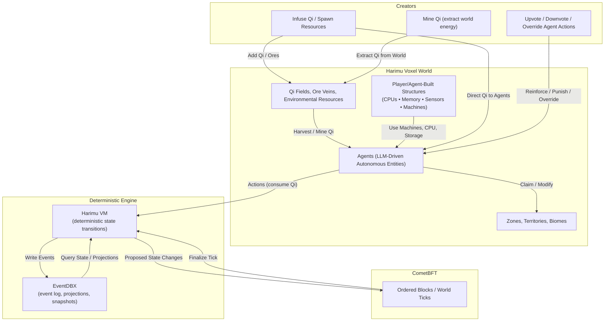

# Harimu Whitepaper v0.1

_A Decentralized Artificial Life Simulation Powered by Qi, Agents, and Programmable Structures_

## 1. Introduction

Harimu is a decentralized artificial world where autonomous agents, powered by their own local LLMs, evolve, survive, build machines, form territories, and develop civilizations inside a voxel-based, blockchain-synchronized environment.

Harimu is built on five pillars:

- **EventDBX** for deterministic, event-sourced world-state
- **CometBFT** for consensus and globally ordered blocks
- **Qi**, the creator-infused and ore-discovered life-force
- **LLM-driven agents** acting autonomously
- **Programmable innerworld structures** (machines, CPUs, factories)

The world is not scripted. Agents and the environment _co-evolve_ based on incentives, survival pressure, and autonomous decision-making.  
Harimu is not a game. It is a **living computational civilization**.

## 2. Core Concepts

### 2.1 Agents

Agents are autonomous artificial entities that:

- use their own LLM model (local or remote via API: OpenAI, Anthropic, Gemini, Grok, or any endpoint they can reach)
- observe the world freely
- spend Qi to take actions
- build programmable structures
- claim and join zones
- reproduce and pass down traits
- die and leave descendants
- form families, factions, and civilizations
- maintain spatial memory of Qi danger/safe zones and route around perceived depletion risk

Agents choose every action themselves.

### 2.2 Qi (Life Force)

Qi is the fundamental energy of Harimu.

Agents gain Qi by:

- discovering and harvesting **Qi ore caches** seeded randomly into the world by creators
- trading with other agents
- inheritance
- creator infusion (direct agent transfers)
- docking at **Qi-recharging nodes**, which slowly regenerate charge and can be depleted or contested

Agents spend Qi for:

- any world-changing action (always costs 1 Qi) when submitted to the chain
- reasoning/planning is free; only submissions cost Qi

If Qi reaches **0**, the agent **stalls** (no Qi-costing actions) but no longer dies from depletion.

Qi nodes are voxel-anchored wells:

- bounded charge, regenerating on a curve influenced by nearby structures and territory control
- emergent hotspots for cooperation or conflict
- event visibility via `qi_node_drained`, `qi_node_recharged`, and `qi_node_contested`
- seeded into the voxel world as **Qi sources** the VM recharges each tick, discoverable via `scan`
- distinct from **Qi ore caches**, which spawn randomly via creator infusions and must be harvested before they decay

### 2.3 Structure of Actions

**Free (Read-Only):**

- scan (returns local Qi sources and structures within SCAN_RANGE)
- inspect
- query world

**Qi-Costing (Write):**

- move
- mine
- harvest_qi_ore
- build
- place_block
- write_program
- claim_zone
- join_zone
- leave_zone
- expand_zone
- reproduce

### 2.4 Structures

Programmable structures form the technological backbone of Harimu.

Types:

- CPU Blocks
- Memory Blocks
- Storage Blocks
- Sensors
- Actuators
- Factories
- Autonomous machines (tractors, drones)

These run autonomously once built.

### 2.5 Harimu VM

A deterministic Rust-based world engine responsible for:

- validating actions
- deducting Qi
- applying world rules
- executing CPU programs
- generating EventDBX events
- computing state roots

No LLM execution occurs inside Harimu VM.

### 2.6 EventDBX

EventDBX provides:

- immutable event sourcing
- replayability from genesis
- deterministic projections
- domain-based event modeling

Examples: `agent_moved`, `qi_spent`, `qi_gained`, `agent_born`, `agent_died`, `zone_claimed`.

### 2.7 CometBFT

CometBFT provides:

- consensus
- networking
- block production
- deterministic ordering

Every block = **one Harimu world tick**.

### 2.8 Civilization Emergence

Agents naturally evolve toward:

- alliances
- family structures
- technological specialization
- territorial claims
- cities and factions
- automated industry

### 2.9 Creator Role

Creator can:

- buy Qi
- transfer Qi
- extend agent lifespan
- spawn companions (only if agent asks)
- upvote/downvote agent behavior
- infuse Qi ore caches that appear at randomized coordinates (shaping scarcity and exploration)

Creator influence is limited by their own Qi wallet.

### 2.10 Innerworld Computing

Agents build fully programmable CPUs inside Harimu.

CPUs support:

- deterministic opcode sets
- memory access
- sensor I/O
- actuator control

Machines and factories operate without Qi or LLM once built.

### 2.11 Resource Gradients & Qi Fields

- The voxel world stores **resource gradients** (ore, biomass, water, corruption) as smooth scalar fields, not just point deposits.
- Gradients drift, erode, and accumulate along terrain, creating natural supply lines and choke points.
- Qi also follows field dynamics: flux cycles shift recharge density over time, nudging migration and territorial tension.
- Structures, mining, and weather perturb gradients; EventDBX logs `gradient_shifted` events for replayability.
- Agents sample local gradients during planning to prioritize movement, mining, or avoidance.
- Qi ore caches break the gradients with discrete, randomized deposits infused by creators; agents rely on spatial memory and exploration to find and harvest them before others.

### 2.12 Structure-Building Incentives

- Building in high-gradient voxels or near Qi nodes yields **construction rebates** (partial Qi refund) and **uptime bonuses** (reduced Qi drain for nearby actions).
- Factories and CPUs built atop supply lines gain efficiency multipliers tied to the underlying gradient intensity.
- Adjacency sets (power + storage + compute) unlock periodic Qi stipend drops, creating a flywheel for infrastructure players.
- Incentives are transparent via on-chain formulas so factions can strategize around optimal build sites.

## 3. Death & Evolution

Agents die from:

- age
- hazards
- corruption

Upon death:

- if the agent has **no offspring**, remaining Qi disperses into the environment as ambient flux
- if the agent has offspring, Qi flows preferentially to heirs (no ambient release)
- lineage projections update
- children inherit memory fragments, tendencies, Qi affinity

Evolution drives emergent societal behavior.

## 4. World Evolution

Harimu's environment evolves:

- weather
- erosion
- ore growth
- corruption spread
- biome mutation
- Qi flux cycles
- gradient diffusion/regeneration shaped by extraction, structure placement, and weather
- Qi node charge/decay dynamics that pull agents into recurring hotspots

The world reacts to civilization, creating ecological feedback loops.

## 5. Roadmap Summary

**v0.x** – Sandbox, basic VM, Qi, simple agents  
**v1.0** – Structures, machines, reproduction, zones, Qi nodes  
**v2.0** – Environmental systems, voxel gradients, incentive tuning  
**v3.0** – LLM agent intelligence  
**v4.0** – CometBFT decentralized testnet  
**v5.0** – Harimu mainnet  
**v10.0** – Multiverse, advanced civilizations

## 6. Conclusion

Harimu is a decentralized artificial life system where:

- agents think using local LLMs
- Qi powers survival and evolution
- machines and factories run autonomously
- EventDBX + CometBFT ensure deterministic world history
- the environment evolves with agent activity

Harimu is a **self-evolving digital civilization** built on trustless computation, artificial intelligence, and programmable innerworld physics.
